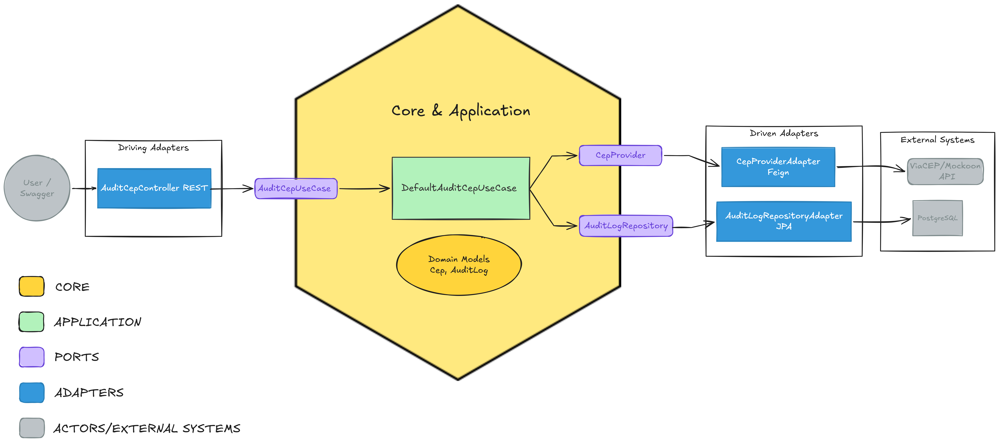

# 📬 API de Auditoria de CEP

Um microsserviço desenvolvido em Java para consulta de endereços via CEP, projetado com foco em resiliência, código limpo e testes automatizados. A aplicação busca dados de uma API externa e registra um log de auditoria no banco de dados para cada consulta realizada.

---

## 📐 Desenho da Solução


*O fluxo garante que requisições externas sejam isoladas e tratadas antes de qualquer persistência no banco de dados.*

---

## 🏗️ Arquitetura e Padrões

O projeto foi construído utilizando os princípios de **SOLID**, **Domain-Driven Design (DDD)** e **Arquitetura Hexagonal (Ports and Adapters)**. 

* **Core/Domain:** Totalmente isolado de frameworks. Contém as regras de negócio e validações rígidas de estado (ex: `Cep`, `AuditLog`).
* **Application (Ports):** Define os Casos de Uso (`AuditCepUseCase`) e os contratos (Interfaces) para comunicação com o mundo externo.
* **Infrastructure (Adapters):** Implementações concretas que interagem com o Spring, Banco de Dados (PostgreSQL) e APIs HTTP (ViaCEP via FeignClient).
* **Fail Fast & Tratamento Global:** Uso de `@RestControllerAdvice` para blindar a aplicação contra indisponibilidades externas e entradas inválidas (Status 400, 404 e 503).

---

## 🛠️ Tecnologias Utilizadas

* **Linguagem:** Java 17/21
* **Framework:** Spring Boot 3.3.x
* **Integração HTTP:** Spring Cloud OpenFeign
* **Banco de Dados:** PostgreSQL 15 (Produção) / H2 (Testes)
* **Infraestrutura:** Docker e Docker Compose
* **Mocks Locais:** Mockoon (Simulação do ViaCEP)
* **Testes:** JUnit 5, Mockito, AssertJ, WireMock (Testes E2E de integração)
* **Documentação:** Swagger (OpenAPI 3)

---

## 🚀 Como Executar o Projeto

### 1. Pré-requisitos
* Docker e Docker Compose instalados.
* Java 17+ (JDK) instalado.

### 2. Subindo a Infraestrutura (Banco e Mocks)
Na raiz do projeto, execute o comando abaixo para subir o banco PostgreSQL e o Mockoon:
```bash
docker-compose up -d
````

### 3\. Executando a Aplicação

A aplicação subirá na porta `8080`.

```bash
./gradlew bootRun
```

*(No Windows, utilize `gradlew.bat bootRun`)*

-----

## 📖 Documentação da API (Swagger)

Com a aplicação rodando, acesse a interface interativa do Swagger para realizar as consultas:
**[http://localhost:8080/swagger-ui.html](https://www.google.com/search?q=http://localhost:8080/swagger-ui.html)**

-----

## 🧪 Como Rodar os Testes

A aplicação possui uma suíte de testes robusta cobrindo toda a Pirâmide de Testes:

* **Testes Unitários:** Validação de regras de Domínio e Adapters sem subir o contexto do Spring.
* **Testes Fatiados (Sliced):** `@WebMvcTest` e `@DataJpaTest` para validar rotas HTTP e persistência.
* **Testes End-to-End (E2E):** Utilizando **WireMock** para simular chamadas externas sem depender da internet, garantindo a integração completa (`Controller -> UseCase -> Feign -> Banco`).

Para executar a suíte completa:

```bash
./gradlew test
```
